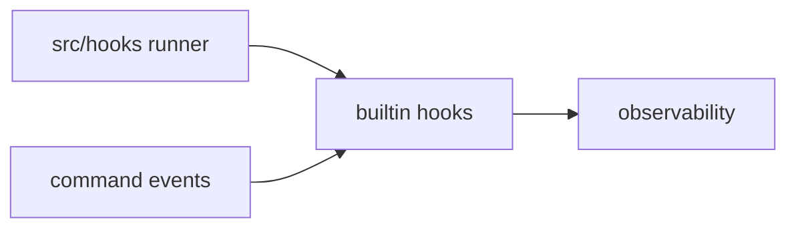

# Builtin Hooks Context

## Purpose

`src/hooks/builtin/` contains hook implementations that ship inside the runtime rather than coming from external extensions.

## File / Folder Map

- `src/hooks/builtin/mod.rs` - built-in hook registration and exports
- `src/hooks/builtin/command_logger.rs` - command logging hook

## Go Here For

- Built-in hook registration: `src/hooks/builtin/mod.rs`
- Command logging behavior: `src/hooks/builtin/command_logger.rs`
- Hook contract questions: step up to `src/hooks/traits.rs`

## Current State

The built-in set is small and intentionally narrow. These hooks support inherited runtime behavior and observability rather than broader GraphClaw architecture.

## Interaction Sketch

Current responsibilities and main neighboring modules:

## GraphClaw Evolution Note

Do not treat built-in hooks as evidence that a larger context engine already exists here.

## Constraints / Cautions

- Built-ins should stay easy to audit.
- Avoid hidden side effects or surprising control flow.
- Keep implementation aligned with the hook traits in `src/hooks/`.

## How Agents Should Work Here

Start with the parent `src/hooks/CONTEXT.md`, then read the specific built-in file. Keep behavior simple, make registration changes explicit, and avoid adding broad policy logic to a convenience hook.
