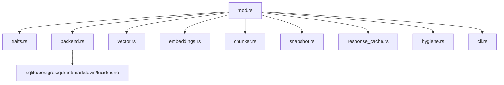
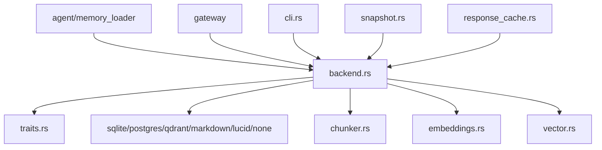
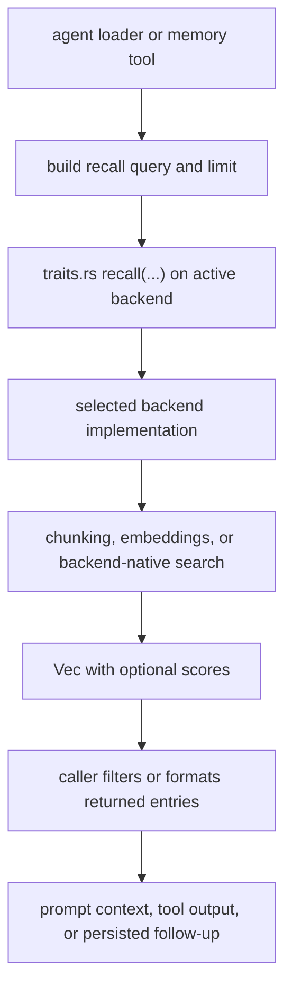

# Memory Context

## Local Purpose

`src/memory/` contains the runtime memory subsystem: storage backends, embeddings, snapshots, chunking, recall support, and memory CLI helpers.

This subtree owns persistence and retrieval for the inherited runtime. It is a major migration seam adjacent to the future Graph Engine, but it is not itself the Graph Context Engine.

## What Belongs Here

- memory storage backends and backend-selection logic;
- embeddings, chunking, and retrieval support;
- source-adjacent `*.map.json` slices for retrieval, compaction, and evidence-flow seams;
- memory-facing CLI and maintenance utilities.

## What Does Not Belong Here

- turn orchestration and prompt assembly that belong in `src/agent/`;
- execution-environment logic that belongs in `src/runtime/`;
- stable context-engine concept definitions that belong in `docs/architecture/`.

## File / Folder Map

- `src/memory/mod.rs` - module entry and shared wiring
- `src/memory/traits.rs` - backend and memory contracts
- `src/memory/backend.rs` - backend selection and orchestration
- `src/memory/sqlite.rs`, `postgres.rs`, `qdrant.rs`, `markdown.rs`, `lucid.rs`, `none.rs` - backend implementations
- `src/memory/vector.rs`, `embeddings.rs`, `chunker.rs` - vector and chunking support
- `src/memory/snapshot.rs`, `response_cache.rs`, `hygiene.rs` - supporting memory maintenance paths
- `src/memory/context-retrieval-compaction.map.json` - graph slice for multi-source recall, compaction, and `SessionWindow` handoff
- `src/memory/cli.rs` - CLI-facing memory commands

## Go Here For

- Backend selection or memory plumbing: `src/memory/backend.rs`
- Backend-specific bugs: the matching backend file
- Embedding or vector retrieval flow: `src/memory/embeddings.rs` and `src/memory/vector.rs`
- Chunking behavior: `src/memory/chunker.rs`
- Memory CLI actions: `src/memory/cli.rs`
- Technical-map slice for retrieval and compaction: `src/memory/context-retrieval-compaction.map.json`

## Current State

This is one of the most important future seam areas for GraphClaw, but today it is still an inherited memory system with multiple backends and retrieval utilities, not a graph-native context engine.

The key documentation discipline here is to keep `memory`, `retrieval`, and `Graph Engine` context resolution separate. They may interact closely, but they are not interchangeable concepts.

Current process ownership in this subtree is roughly:

- backend selection and persistence plumbing;
- embeddings and vector recall support;
- chunking and derived retrieval units;
- maintenance helpers such as snapshots and caches;
- memory-facing CLI surfaces.

## Mermaid Maps

### Local Capacity Map

## Current Dependency Direction

- Read by the agent loop through `src/agent/memory_loader.rs`, by gateway/webhook flows that persist message state, and by CLI-facing commands through `src/memory/cli.rs`.
- Uses `src/memory/traits.rs` as the runtime contract, while `src/memory/backend.rs` mainly classifies or describes configured backend choices before concrete implementations such as `sqlite.rs`, `postgres.rs`, `qdrant.rs`, `markdown.rs`, and `none.rs` are selected.
- Depends on embedding and chunking helpers in `embeddings.rs`, `vector.rs`, and `chunker.rs` to turn raw text into retrievable artifacts.

### Current Interaction Map

### Current Sequential Retrieval Flow

## Routing

- if the change affects persistence semantics, stay in this subtree
- if the change affects turn assembly, go to `src/agent/`
- if the change affects stable GraphClaw concepts like `GraphSet` or `ContextPack`, document that first in `docs/architecture/`
- if the change affects backend reference framing for graph storage, update `docs/backends/`

## GraphClaw Evolution Note

Be precise: storage, recall, and future Graph Engine context resolution are related but not identical. Do not describe current memory code as if graph-native context traversal already exists.

## Likely Migration Seams

1. `src/memory/traits.rs` is the seam for introducing a graph-facing storage abstraction without forcing every existing backend to disappear immediately.
2. `src/memory/backend.rs` is the seam for selecting between legacy memory backends and future graph-capable context stores.
3. `src/memory/vector.rs` and `src/memory/embeddings.rs` are where semantic recall can later become one input into context resolution rather than the whole mechanism.
4. `src/memory/chunker.rs` and category metadata are likely precursors to future graph nodes, evidence items, or packed context sections.
5. `src/memory/snapshot.rs` and `response_cache.rs` should remain operational concerns, not become dumping grounds for context-engine logic.

Likely future artifacts consumed or produced here include:

- consumed: retrieval requests, graph-facing storage operations, and persistence commands for materialized helper artifacts;
- produced: recall candidates, evidence items, summaries, or stored trace/materialization records that a context layer may later consume.

If GraphClaw later introduces a graph-facing adapter boundary, this subtree should describe that as one source of context material, not as proof that memory and context have merged into one subsystem.

Responsibilities that should not drift here:

- final `View` governance;
- packability policy;
- complete `ThinkingContext` ownership;
- final `ContextPack` policy semantics.

This subtree should usually implement storage and retrieval interfaces that context creation consumes, rather than defining the full context model locally.

## What Must Stay Stable During Migration

- Existing memory backend compatibility and persistence semantics
- CLI and operator expectations around memory commands
- Current recall behavior unless a migration task explicitly changes relevance strategy
- Clear separation between persistence, ranking, chunking, and maintenance code paths

## Constraints / Cautions

- Backend compatibility and stored data formats matter.
- Retrieval quality changes can look like model regressions.
- Keep CLI, backend, and ranking concerns separated.
- Do not equate current recall output with a governed `View`, `GraphSet`, or `SessionWindow` unless the implementation explicitly supports those contracts.
- Do not let a graph-map slice collapse storage, retrieval, and context resolution into one implemented subsystem.

## References

- `src/CONTEXT.md` - parent runtime routing
- `src/agent/CONTEXT.md` - current consumer of retrieval and hydration
- `docs/architecture/graph-context-engine.md` - target distinction between memory and context
- `docs/backends/memgraph.md` - backend reference framing for future graph integration

## How Agents Should Work Here

Identify whether the task is about persistence, embeddings, retrieval, or operator tooling before editing.

Recommended exploration order:

1. `src/memory/traits.rs`
2. `src/memory/backend.rs`
3. `src/memory/embeddings.rs` and `src/memory/vector.rs`
4. the concrete backend file you need

Write tests for behavior changes, and document new seams rather than collapsing everything into `mod.rs`.
