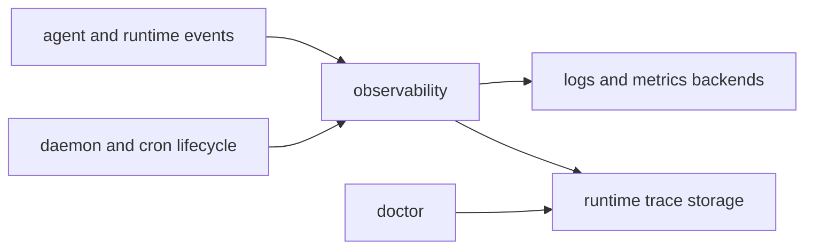

# Observability Context

## Purpose

`src/observability/` owns logging, metrics, tracing, runtime trace storage, and observer abstractions.

## File / Folder Map

- `src/observability/mod.rs` - module entry and shared wiring
- `src/observability/traits.rs` - observer contracts
- `src/observability/log.rs` - log backend
- `src/observability/prometheus.rs` - Prometheus metrics backend
- `src/observability/otel.rs` - OpenTelemetry backend
- `src/observability/runtime_trace.rs` - runtime trace capture/storage
- `src/observability/multi.rs`, `noop.rs`, `verbose.rs` - backend composition and variants

## Go Here For

- Observer interfaces: `src/observability/traits.rs`
- Plain logging changes: `src/observability/log.rs`
- Metrics export: `src/observability/prometheus.rs`
- OTel integration: `src/observability/otel.rs`
- Runtime trace inspection support: `src/observability/runtime_trace.rs`

## Current State

This is inherited reporting infrastructure that helps explain runtime behavior without changing the runtime itself.

## Interaction Sketch

Current responsibilities and main neighboring modules:

## GraphClaw Evolution Note

Do not present observability as if it already materializes a GraphClaw context graph. It currently records logs, traces, and metrics for the inherited runtime.

## Constraints / Cautions

- Keep signals useful and low-noise.
- Instrumentation should not secretly redefine business logic.
- Trace and metrics changes can affect operator workflows and storage costs.

## How Agents Should Work Here

Start from the concrete backend or trace path you need, then inspect shared traits. Prefer additive instrumentation, preserve stable signal names when possible, and verify that new reporting aligns with the behavior it claims to describe.
