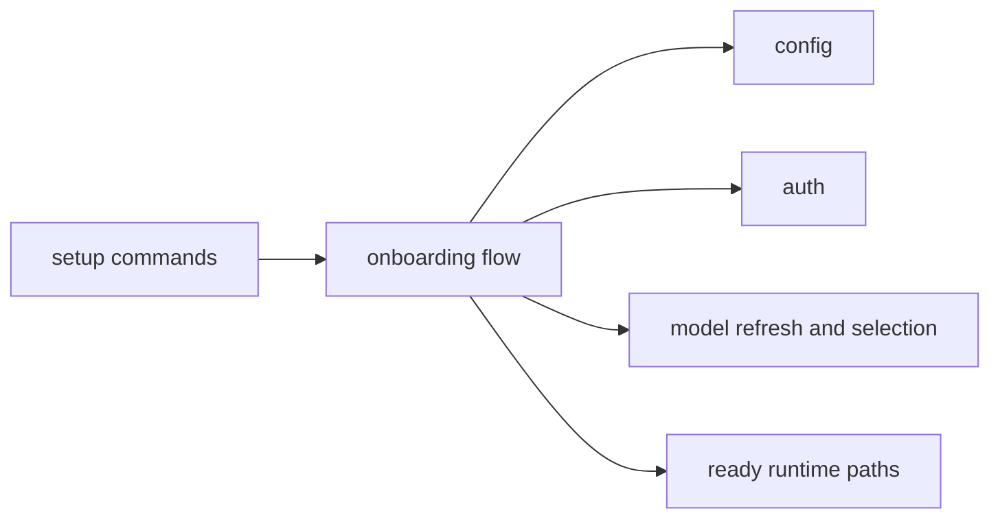

# Onboard Context

## Purpose

`src/onboard/` implements setup and onboarding flows for configuring the runtime.

## File / Folder Map

- `src/onboard/mod.rs` - setup entrypoints and onboarding helpers
- `src/onboard/wizard.rs` - interactive wizard flow

## Go Here For

- Quick setup behavior: `src/onboard/mod.rs`
- Interactive onboarding prompts and wizard flow: `src/onboard/wizard.rs`
- Model refresh/list/set helpers invoked from the CLI: `src/onboard/mod.rs`

## Current State

This folder still guides users through inherited `zeroclaw` setup flows and configuration assumptions.

## Interaction Sketch

Current responsibilities and main neighboring modules:

## GraphClaw Evolution Note

Do not rewrite onboarding as if repository migration were already complete. GraphClaw still onboards users into inherited runtime surfaces from this area.

## Constraints / Cautions

- Setup copy and prompts are user-facing contract.
- Onboarding must stay truthful about what the runtime actually supports.
- Avoid introducing migration promises the code does not yet fulfill.

## How Agents Should Work Here

Read both files before editing user-visible flows. Keep wording aligned with actual config and runtime behavior, preserve repair and quick-setup paths, and test CLI-facing changes where practical.
