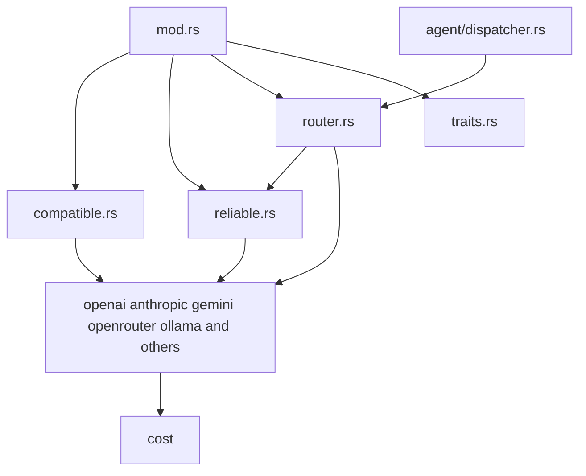
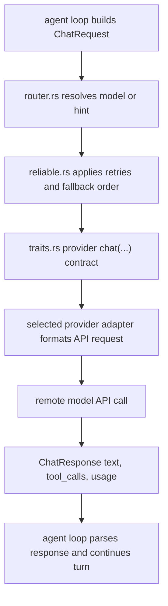

# Providers Context

## Local Purpose

`src/providers/` contains model-provider integrations, provider routing, retries, compatibility adapters, and provider traits.

This subtree owns model access and provider compatibility. It sits adjacent to the future Graph Engine seam. It may later consume richer `ContextPack` inputs and emit results that feed `ResolutionTrace` handling elsewhere, but it does not define those concepts.

## What Belongs Here

- provider contracts and adapters;
- provider selection, retries, and compatibility behavior;
- provider-specific API integration detail.

## What Does Not Belong Here

- context-engine concept definitions;
- agent-loop policy for when a provider should be called;
- persistence and retrieval logic that belongs in `src/memory/`.

## File / Folder Map

- `src/providers/mod.rs` - provider registry and public entrypoints
- `src/providers/traits.rs` - core provider contracts
- `src/providers/router.rs` - provider selection and routing logic
- `src/providers/reliable.rs` - retry/reliability wrapper behavior
- `src/providers/compatible.rs` - compatibility adapter helpers
- `src/providers/openai.rs`, `anthropic.rs`, `gemini.rs`, `openrouter.rs`, `ollama.rs` - major provider implementations

## Go Here For

- Provider interface changes: `src/providers/traits.rs`
- Routing decisions: `src/providers/router.rs`
- Retry/fallback behavior: `src/providers/reliable.rs`
- Provider-specific API bugs: the matching provider file
- OpenAI-compatible endpoint handling: `src/providers/compatible.rs`

## Current State

This is a major inherited extension surface for model access. It remains provider-centric infrastructure rather than GraphClaw-specific reasoning machinery.

The main documentary rule here is that providers consume upstream request payloads shaped by the agent loop today, and may later consume a final `ContextPack`; they do not define the GraphClaw context model or the `ThinkingContext` that precedes it.

## Mermaid Map

### Current Sequential Provider Invocation Flow

## Current Dependency Direction

- Called primarily from `src/agent/dispatcher.rs` and the surrounding agent loop.
- Consumes prompt and response payloads shaped upstream by `src/agent/`, and may later consume outputs from future Graph Engine seams.
- Interacts with `src/cost/` for usage accounting and with `src/observability/` or related runtime paths for execution visibility.

## Routing

- provider request/response contracts belong here
- turn orchestration belongs in `src/agent/`
- stable context semantics belong in `docs/architecture/`

## GraphClaw Evolution Note

Future GraphClaw work may ask providers for richer context-aware behavior, but this folder currently implements ordinary provider adapters and routing.

Today, this area contributes to the model by consuming selected context faithfully and returning outputs that may later feed `ResolutionTrace` or post-turn persistence flows elsewhere.

## Constraints / Cautions

- Provider contracts are wide and user-visible.
- Retry/routing bugs can look like model or tool failures elsewhere.
- Keep provider maintenance separate from context-engine ambitions.

## References

- `src/agent/CONTEXT.md` - main caller boundary
- `src/cost/CONTEXT.md` - usage accounting boundary
- `docs/architecture/graph-context-engine.md` - target model for `ContextPack` and `ResolutionTrace` handling around providers
- `docs/architecture/glossary.md` - stable terminology for packs, windows, and thinking context

## How Agents Should Work Here

Read `traits.rs`, the concrete provider file, and any router/reliability wrapper involved in the path you are changing. Preserve compatibility, avoid cross-provider rewrites unless necessary, and document any config or API contract change.
