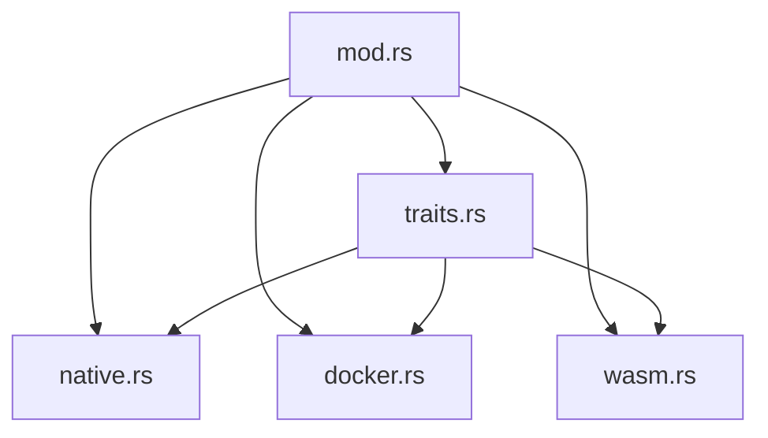
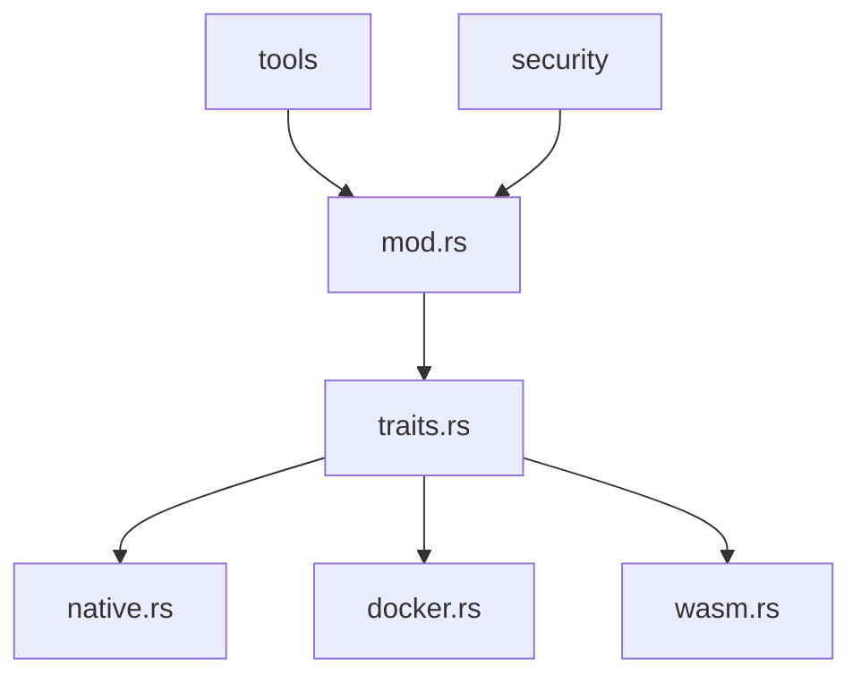
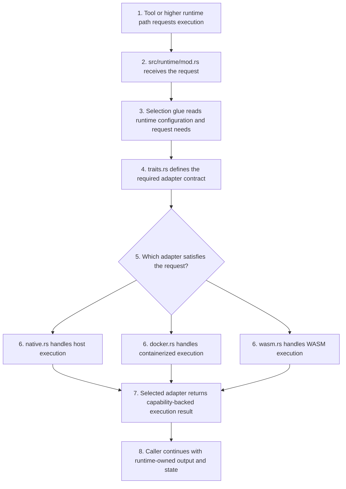

# Runtime Context

## Local Purpose

`src/runtime/` defines execution-environment adapters such as native, Docker, and WASM, plus the contracts that tools and sandboxed execution depend on.

This subtree exists to expose execution capabilities safely and consistently. It supports the agent and any future Graph Engine seam consumers, but it is not where GraphClaw context semantics should be defined.

## What Belongs Here

- execution-adapter contracts;
- concrete native, Docker, and WASM runtime behavior;
- source-adjacent `*.map.json` slices for runtime governance, mutation validation, and budget seams;
- capability surfaces needed by tools and security-sensitive execution.

## File / Folder Map

- `src/runtime/mod.rs` - module entry and runtime selection glue
- `src/runtime/traits.rs` - runtime adapter contracts
- `src/runtime/native.rs` - native runtime implementation
- `src/runtime/docker.rs` - Docker-backed runtime implementation
- `src/runtime/wasm.rs` - WASM runtime implementation
- `src/runtime/session-window-governance.map.json` - graph slice for `SessionWindow` mutation governance and trace recompilation

## Go Here For

- Adapter interface changes: `src/runtime/traits.rs`
- Native execution behavior: `src/runtime/native.rs`
- Containerized execution: `src/runtime/docker.rs`
- WASM execution path: `src/runtime/wasm.rs`
- Technical-map slice for mutation governance: `src/runtime/session-window-governance.map.json`

## Current State

This is a high-leverage inherited boundary because execution behavior fans out into tools, security, and operator expectations.

It should be documented as infrastructure for the runtime, not as the owner of context reasoning or as the Graph Engine itself.

Current process ownership in this subtree is roughly:

- execution adapter selection;
- filesystem and process capability exposure;
- containerized or sandboxed execution behavior;
- runtime storage-path and capability contracts consumed by higher layers.

## Mermaid Maps

### Local Capacity Map

## Current Dependency Direction

- Consumed mainly by `src/tools/` and security-sensitive execution paths that need shell, filesystem, process, or storage behavior.
- Adapter contracts are centralized in `src/runtime/traits.rs`; concrete behavior fans out into `native.rs`, `docker.rs`, and `wasm.rs`.
- Runtime choices also shape daemon, gateway, and operator expectations even when those modules do not own adapter logic directly.

### Current Interaction Map

### Sequential Adapter Selection Path

## Routing

- tool capability consumers belong in `src/tools/`
- persistence and retrieval concerns belong in `src/memory/`
- context-model questions belong in `docs/architecture/`

## GraphClaw Evolution Note

Do not portray these adapters as a finished GraphClaw execution graph. They are current runtime backends and likely future seam consumers that graph-oriented coordination may sit above.

## Likely Migration Seams

1. `src/runtime/traits.rs` is the seam for any future context-engine runtime dependencies such as artifact storage, capability introspection, or graph-aware execution policies.
2. `storage_path()` is a likely seam for future GraphClaw runtime artifacts, but that should happen by adding explicit artifact layers above the runtime, not by turning adapters into context engines.
3. Adapter capability reporting is a likely seam for future context-packing policies that need to know whether a runtime can persist, execute, or maintain long-lived state.

Likely future artifacts supported here include persisted traces, materialized helper subsets, or capability reports that higher-level context code consumes.

Responsibilities that should not drift here:

- canonical `View` semantics;
- `View` manipulation rules;
- final packing policy;
- ownership of `ThinkingContext`.

## What Must Stay Stable During Migration

- Current shell/filesystem/runtime capability semantics
- Clear adapter boundaries between native, Docker, and WASM implementations
- Compatibility for tools and security layers that already depend on the current trait contract

## Constraints / Cautions

- Runtime changes can affect security, filesystem access, and tool behavior.
- Adapter contracts should stay explicit and testable.
- Avoid leaking backend-specific assumptions into shared code.
- Do not read a local graph-map slice as proof that runtime governance objects already exist in the current adapters.

## References

- `src/tools/CONTEXT.md` - main consumer boundary
- `src/security/CONTEXT.md` - safety and policy boundary
- `docs/architecture/concepts/graph-context-engine.md` - context-layer concepts that may sit above runtime adapters

## How Agents Should Work Here

Read `traits.rs` plus the concrete adapter you are changing and any caller in `src/tools/` or `src/security/`. Treat changes as architectural work, verify compatibility, and prefer small seam-preserving edits over cross-adapter rewrites.
