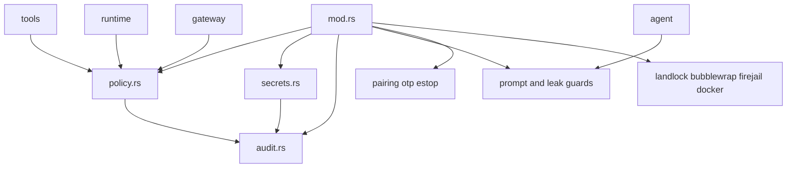
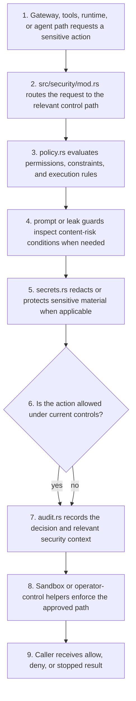

# Security Context

## Local Purpose

`src/security/` handles runtime safety controls: policy enforcement, secret handling, sandbox helpers, audit paths, prompt guardrails, pairing, OTP, and emergency stop controls.

This subtree owns safety constraints for the current runtime. Future GraphClaw context work may depend on these controls as seam consumers, but it must not silently absorb or bypass them.

## What Belongs Here

- runtime safety and policy enforcement;
- secret protection and audit support;
- sandbox and operator-control security flows.

## What Does Not Belong Here

- generic context-resolution logic;
- provider integration detail that belongs in `src/providers/`;
- transport contract ownership that belongs in `src/gateway/`.

## File / Folder Map

- `src/security/mod.rs` - module entry and shared exports
- `src/security/policy.rs` - policy decisions and enforcement helpers
- `src/security/secrets.rs` - secret storage and redaction helpers
- `src/security/audit.rs` - audit logging support
- `src/security/pairing.rs`, `otp.rs`, `estop.rs` - operator-control security flows
- `src/security/landlock.rs`, `bubblewrap.rs`, `firejail.rs`, `docker.rs` - sandbox/environment helpers
- `src/security/prompt_guard.rs`, `detect.rs`, `domain_matcher.rs`, `leak_detector.rs` - content and risk checks

## Go Here For

- Policy or permission logic: `src/security/policy.rs`
- Secret storage/redaction: `src/security/secrets.rs`
- Audit output: `src/security/audit.rs`
- Pairing, OTP, or estop behavior: matching control file
- Sandbox integration details: the relevant backend helper file

## Current State

This is one of the highest-risk inherited runtime areas. It contains real safety controls used by the current system, not just future-facing placeholders.

It should be described as the policy and protection boundary around the runtime, not as a future graph-native policy engine already in place or as the Graph Engine itself.

## Mermaid Map

## Current Dependency Direction

- Called by execution-sensitive paths in `src/tools/`, `src/runtime/`, `src/gateway/`, and agent-driven workflows that require approval or protection checks.
- Constrains how current and future `ContextPack`-driven actions can be executed, persisted, or exposed.
- Emits or shapes audit-relevant information that may later intersect with `ResolutionTrace`, while remaining a distinct safety layer.

## Sequential Enforcement Path

## Routing

- transport auth and session protocols belong in `src/gateway/`
- runtime adapter constraints belong in `src/runtime/`
- stable policy-facing GraphClaw concepts belong in `docs/architecture/`

## GraphClaw Evolution Note

Do not describe this folder as if GraphClaw already ships a new graph-native policy engine. Current safety behavior is implemented through inherited runtime controls here.

Today, this area contributes to the model by enforcing the policy boundary around context-driven actions rather than by defining context semantics itself. It is a current runtime owner and future seam consumer, not the Graph Engine.

## Constraints / Cautions

- Do not weaken protections casually.
- Security changes usually require tests, docs, and careful threat reasoning.
- Keep policy, storage, auditing, and sandbox concerns distinct.

## References

- `src/runtime/CONTEXT.md` - execution boundary
- `src/gateway/CONTEXT.md` - transport and external-session boundary
- `docs/architecture/graph-context-engine.md` - target model whose future policies must still pass through explicit safety controls

## How Agents Should Work Here

Read the exact control path end to end before editing. Favor explicit reasoning, preserve secure defaults, add or update tests for behavior changes, and call out residual risk if a change cannot be fully verified.
