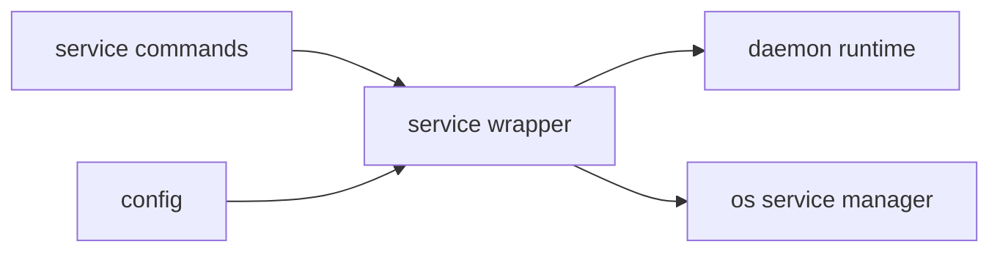

# Service Context

## Purpose

`src/service/` manages OS-service lifecycle behavior for running the daemon as a background service.

## File / Folder Map

- `src/service/mod.rs` - service install/start/stop/status/uninstall handling

## Go Here For

- Service lifecycle commands: `src/service/mod.rs`
- Integration with daemon runtime startup: read `src/daemon/` alongside this module

## Current State

This is a thin inherited orchestration layer that translates runtime behavior into service-manager operations.

## Current Dependency Direction

- Entered from CLI/service command wiring in `src/main.rs`.
- Delegates operational startup semantics to the daemon/runtime stack rather than owning product behavior itself.

## Interaction Sketch

Current responsibilities and main neighboring modules:

## GraphClaw Evolution Note

Do not imply that service management has been reworked around a new GraphClaw architecture. It currently manages the inherited daemon/runtime stack.

## Likely Migration Seams

1. Service install/start behavior may eventually need to understand new GraphClaw artifact locations or background workers.
2. That migration should happen by adapting service wiring to new runtime seams, not by embedding context-engine logic inside the service wrapper.

## Constraints / Cautions

- Service bugs are operationally disruptive.
- OS-init differences matter even if the module is small.
- Keep policy and runtime logic out of the service wrapper when possible.

## How Agents Should Work Here

Read the whole module and the daemon entrypoint before changing behavior. Keep the layer thin, make user-visible lifecycle semantics explicit, and verify any change against the target init-system path it affects.
