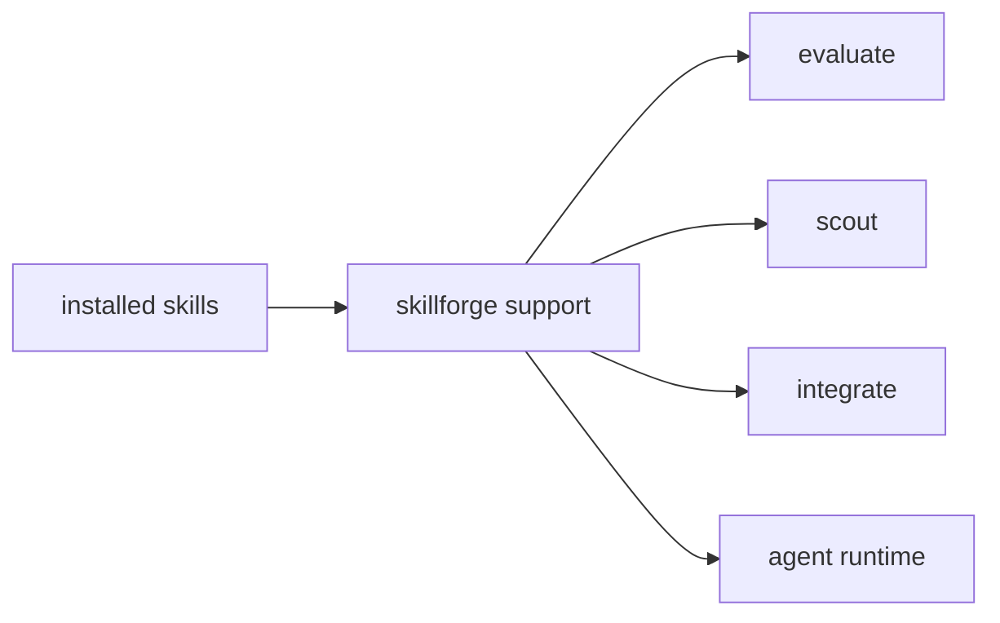

# Skillforge Context

## Purpose

`src/skillforge/` contains runtime-side skill evaluation, scouting, and integration support.

## File / Folder Map

- `src/skillforge/mod.rs` - module entry
- `src/skillforge/evaluate.rs` - evaluation flows
- `src/skillforge/scout.rs` - scouting/discovery helpers
- `src/skillforge/integrate.rs` - integration helpers

## Go Here For

- Skill evaluation behavior: `src/skillforge/evaluate.rs`
- Skill discovery/scouting: `src/skillforge/scout.rs`
- Skill integration mechanics: `src/skillforge/integrate.rs`

## Current State

This is an inherited experimentation and capability-support surface adjacent to the agent runtime, not the central execution loop itself.

## Interaction Sketch

Current responsibilities and main neighboring modules:

## GraphClaw Evolution Note

Do not present this folder as if it already implements a full GraphClaw skill graph. It remains a targeted runtime support area.

## Constraints / Cautions

- Keep experimental capability work from bleeding into core runtime paths by accident.
- Maintain clear boundaries with repository-side `.agents/skills/` content.
- Be explicit about what runs at runtime versus what is packaging or metadata.

## How Agents Should Work Here

Check whether the task belongs in runtime skill support or in repository skill docs first. Keep evaluation, scouting, and integration responsibilities separated, and update local context if the scope of this folder materially changes.
