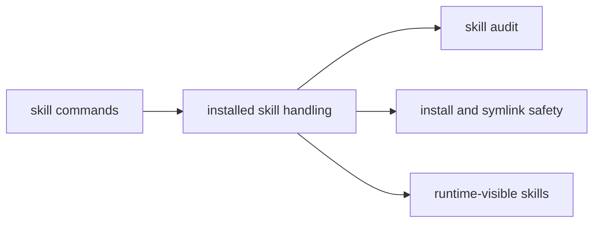

# Skills Context

## Purpose

`src/skills/` contains runtime-facing skill support such as audits and install/remove handling.

## File / Folder Map

- `src/skills/mod.rs` - skill command handling and module entry
- `src/skills/audit.rs` - skill auditing behavior
- `src/skills/symlink_tests.rs` - symlink-oriented safety tests/helpers

## Go Here For

- Runtime skill command flow: `src/skills/mod.rs`
- Skill audit behavior: `src/skills/audit.rs`
- Symlink-related test coverage: `src/skills/symlink_tests.rs`

## Current State

This folder is about runtime behavior around installed skills. Repository agent instructions and authoring docs live elsewhere.

## Interaction Sketch

Current responsibilities and main neighboring modules:

## GraphClaw Evolution Note

Do not blur runtime skill support with future GraphClaw capability graphs. Current behavior is still the inherited install/audit path.

## Constraints / Cautions

- Skill install and audit paths touch trust boundaries.
- Keep runtime handling separate from repository documentation conventions.
- Be careful with filesystem and symlink assumptions.

## How Agents Should Work Here

Start with `src/skills/mod.rs` and then inspect the specific audit or test path involved. Preserve safety checks, keep trust boundaries explicit, and avoid moving repo-side skill concerns into runtime code unless the task explicitly calls for it.
