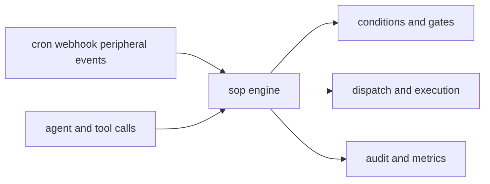

# SOP Context

## Purpose

`src/sop/` implements the SOP subsystem: engine behavior, dispatch, conditions, gates, metrics, audits, and shared types.

## File / Folder Map

- `src/sop/mod.rs` - module entry and public surface
- `src/sop/engine.rs` - SOP execution engine
- `src/sop/dispatch.rs` - routing/dispatch logic
- `src/sop/condition.rs` - condition evaluation
- `src/sop/gates.rs` - gate enforcement
- `src/sop/metrics.rs` - metrics collection
- `src/sop/audit.rs` - audit/reporting helpers
- `src/sop/types.rs` - shared SOP data types

## Go Here For

- Core SOP execution rules: `src/sop/engine.rs`
- Routing or action dispatch: `src/sop/dispatch.rs`
- Condition logic: `src/sop/condition.rs`
- Gate behavior: `src/sop/gates.rs`
- Shared types or metrics: `src/sop/types.rs` and `src/sop/metrics.rs`

## Current State

This is a real inherited runtime behavior subsystem, not just naming or documentation scaffolding.

## Interaction Sketch

Current responsibilities and main neighboring modules:

## GraphClaw Evolution Note

If SOP work later intersects with graph-oriented policy, document the seam clearly. Do not imply that this folder already is the GraphClaw context engine.

## Constraints / Cautions

- Engine, condition, and gate semantics are behavior-critical.
- Keep audit/metrics support secondary to correct execution logic.
- Avoid mixing policy experiments into unrelated dispatch helpers.

## How Agents Should Work Here

Read the engine, dispatch, and types together before changing behavior. Prefer tests-first edits, keep rule evaluation explicit, and document any new relationship between SOP logic and other runtime areas instead of assuming the connection is obvious.
