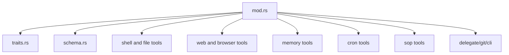
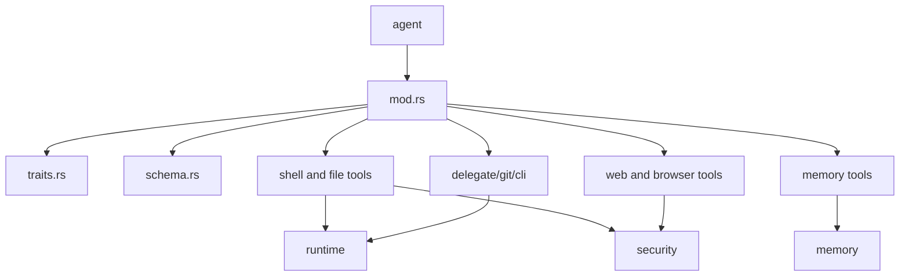
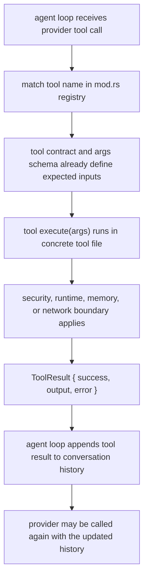

# Tools Context

## Local Purpose

`src/tools/` contains built-in tool implementations and tool contracts for filesystem, shell, web, memory, cron, browser, SOP, and hardware-adjacent runtime actions.

This subtree owns capability exposure and execution contracts. It is adjacent to agent orchestration and the future Graph Engine seam, but it is not the Graph Context Engine itself.

## What Belongs Here

- tool registration and discovery;
- shared tool contracts and schemas;
- source-adjacent `*.map.json` slices for capability, action, and execution seams;
- concrete tool execution behavior.

## What Does Not Belong Here

- turn orchestration policy that belongs in `src/agent/`;
- runtime adapter implementation that belongs in `src/runtime/`;
- stable context semantics that belong in `docs/architecture/`.

## File / Folder Map

- `src/tools/mod.rs` - tool registry and module entry
- `src/tools/traits.rs` - core tool contracts
- `src/tools/schema.rs` - tool schema/types support
- `src/tools/shell.rs`, `file_read.rs`, `file_write.rs`, `file_edit.rs` - local execution and file tools
- `src/tools/web_fetch.rs`, `http_request.rs`, `browser.rs`, `browser_open.rs` - network and browser-facing tools
- `src/tools/memory_*.rs`, `cron_*.rs`, `sop_*.rs` - subsystem-specific tool families
- `src/tools/delegate.rs`, `git_operations.rs`, `cli_discovery.rs` - specialized orchestration helpers
- `src/tools/capability-action-execution.map.json` - graph slice for capability resolution, tools, actions, and execution output

## Go Here For

- Shared tool contracts: `src/tools/traits.rs`
- Tool registration or availability: `src/tools/mod.rs`
- A specific tool bug: the matching tool file
- Tool schema/metadata behavior: `src/tools/schema.rs`
- Browser or web execution: `src/tools/browser.rs`, `browser_open.rs`, `web_fetch.rs`
- Technical-map slice for capability/action separation: `src/tools/capability-action-execution.map.json`

## Current State

This is one of the broadest and highest-risk inherited runtime surfaces because tools bridge user intent, execution, security controls, and external systems.

It should be described as a capability layer adjacent to the Graph Engine, not as the owner of context policy.

Current process ownership in this subtree is roughly:

- registering callable capabilities;
- validating tool schemas and contracts;
- executing concrete tool actions;
- returning results that may later become structured evidence.

## Mermaid Maps

### Local Capacity Map

## Current Dependency Direction

- Tool registration starts in `src/tools/mod.rs` and is consumed primarily by the agent loop in `src/agent/`.
- Concrete tools call outward into `src/runtime/`, `src/security/`, `src/memory/`, `src/cron/`, `src/sop/`, web/network clients, and optional hardware integrations.
- Tool schemas and contracts are centralized in `src/tools/traits.rs` and `src/tools/schema.rs`, while individual files own execution details.

### Current Interaction Map

### Current Sequential Tool Execution Flow

## Routing

- context-selection logic belongs in `docs/architecture/` or the future owning runtime seam, not in generic tool docs
- runtime execution semantics belong in `src/runtime/`
- memory persistence and retrieval belong in `src/memory/`
- agent-loop decisions about when tools run belong in `src/agent/`

## GraphClaw Evolution Note

Do not describe the tool layer as a completed GraphClaw orchestration fabric. It is still a set of concrete runtime tools built on inherited contracts.

## Likely Migration Seams

1. `src/tools/traits.rs` is the seam for carrying richer capability metadata without changing every tool implementation at once.
2. `src/tools/mod.rs` is the seam for future GraphClaw capability exposure, selective tool packing, and context-aware tool registration.
3. Tool result handling is a likely seam for future context ingestion, where execution output can become structured runtime evidence rather than only text fed back to the model.
4. `delegate.rs` is a likely seam for future graph-aware sub-agent orchestration, but it should stay compatible with current delegation behavior until that work is explicit.

The key architectural caution here is that `ThinkingContext` and graph navigation before response are not ordinary tools. They are Graph Engine system phases that may use tool-like operations internally.

That means this subtree may later provide:

- callable tools whose outputs feed context resolution;
- capability metadata that helps context packing decide what can be executed or exposed.

It should not become the canonical home for:

- `View` governance;
- `View` semantics;
- final `ContextPack` ownership;
- the whole reflective context phase.

## What Must Stay Stable During Migration

- Existing tool names, parameter schemas, and availability rules unless a migration task explicitly changes them
- Security-policy enforcement around shell, file, browser, and network actions
- Operator trust that tool behavior matches the current docs and runtime constraints

## Constraints / Cautions

- Tool behavior is user-visible and trust-sensitive.
- Security and runtime implications often sit outside the individual tool file.
- Avoid adding tools or capabilities that quietly shift architecture without documentation.
- Future context-aware tool ingestion should not retroactively redefine all tool output as a `ContextPack` or `ResolutionTrace`.
- Do not treat a local graph-map slice as a claim that the capability/action boundary has already been implemented.

## References

- `src/agent/CONTEXT.md` - main orchestrator boundary
- `src/runtime/CONTEXT.md` - execution adapter boundary
- `src/memory/CONTEXT.md` - persistence and retrieval boundary
- `docs/architecture/concepts/graph-context-engine.md` - target model for `ContextPack`, `ResolutionTrace`, and related context-engine behavior

## How Agents Should Work Here

Start with `src/tools/mod.rs`, `src/tools/traits.rs`, and the exact tool file you need.

Recommended exploration order:

1. `src/tools/traits.rs`
2. `src/tools/mod.rs`
3. the concrete tool file
4. the linked caller or policy path in `src/agent/`, `src/security/`, or `src/runtime/`

Keep boundaries explicit, check security/runtime callers when behavior changes, and verify affected tests because regressions here often surface as broader agent failures.
