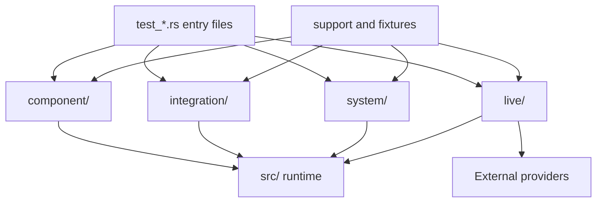

# Tests Context

## Local Purpose

Top-level Rust test harness layout for the inherited runtime: thin entry files at this level route into the layer-specific subtrees below.

This subtree owns behavior validation for the current repository. It should express GraphClaw's testing discipline without pretending the target architecture is already implemented.

## What Belongs Here

- test-layer routing and validation boundaries;
- current behavior checks for the inherited runtime;
- test strategy updates when runtime or process expectations change.

## What Does Not Belong Here

- architectural claims that belong in `docs/architecture/`;
- production runtime logic;
- documentation-only validation concerns being rewritten as product tests.

## File Map

- `test_component.rs`, `test_integration.rs`, `test_live.rs`, `test_system.rs` - top-level suite entrypoints
- `component/`, `integration/`, `live/`, `system/` - behavior layers
- `support/` - shared mocks, helpers, and assertions
- `fixtures/` - static test assets and trace samples
- `manual/` - human-run validation scripts and notes

## Routing

Top-level `test_*.rs` files dispatch into `mod.rs` files inside each layer, then into focused case files such as `component/gateway.rs` or `integration/channel_routing.rs`.

- deterministic behavior checks should prefer `component/` or `integration/`
- broad runtime confidence belongs in `system/`
- documentation-only validation belongs in docs quality and links gates, not in product tests

## Interaction Map

## Current State

This tree still validates inherited `zeroclaw` behavior and naming. It is the main place where GraphClaw's TDD discipline should be expressed when runtime behavior changes.

## Current Dependency Direction

- Consumes runtime behavior from `src/` through the test harness layers below.
- Crosses into agent, gateway, memory, tools, and provider boundaries depending on the suite.
- Remains the place where future explicit `SessionWindow`, `ContextPack`, or `ResolutionTrace` behavior should be validated once those artifacts are real and observable.

## GraphClaw Relevance

The GraphClaw migration is not a rename-first effort. Tests here should clarify current guarantees while the context-engine direction is still being scaffolded.

Today, this subtree contributes confidence in the inherited seams that GraphClaw will later formalize.

## References

- `AGENTS.md` - TDD and documentation-only rules
- `docs/architecture/graph-context-engine.md` - target concepts that may later need explicit behavioral coverage
- nearest child `CONTEXT.md` - layer-specific test ownership

## Cautions

- Do not rename inherited test modules just to match GraphClaw branding.
- Keep deterministic layers ahead of `live/` and `manual/` whenever the same risk can be covered more cheaply.
- Do not describe existing tests as validating `SessionWindow`, `ThinkingContext`, or `ContextPack` unless the implementation and assertions truly do so.

## Agent Guidance

- Read the nearest child `CONTEXT.md` before editing a specific layer.
- For behavioral work, decide which test layer should fail first; for documentation-only work, run doc audits instead of adding product tests.
