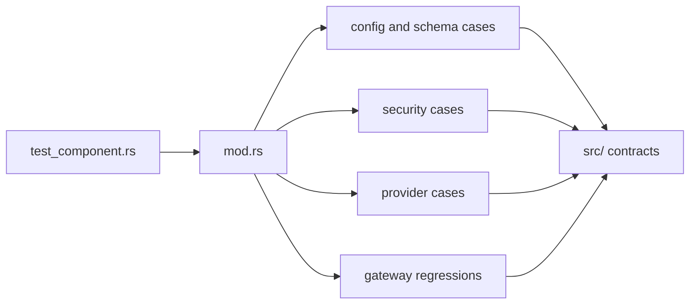

# Component Tests Context

## Local Purpose

Fast Rust tests for narrow runtime behavior, config parsing, schema checks, security rules, and regressions that do not need multi-subsystem orchestration.

This subtree owns the fastest validation layer for precise runtime contracts. It should catch migration-adjacent breakage early without pretending the GraphClaw target architecture is already implemented.

## What Belongs Here

- narrow behavior checks with cheap setup;
- schema, config, security, and regression guards;
- fast validation for explicit low-level contracts.

## File Map

- `mod.rs` - local module router
- `config_schema.rs`, `config_persistence.rs` - config shape and persistence checks
- `provider_schema.rs`, `provider_resolution.rs` - provider contract coverage
- `security.rs`, `whatsapp_webhook_security.rs` - security-focused cases
- `gateway.rs`, `dockerignore_test.rs` - focused gateway and packaging regressions
- `reply_target_field_regression.rs`, `otel_dependency_feature_regression.rs` - narrow regression guards

## Routing

`tests/test_component.rs` enters this layer, `mod.rs` wires the suite, and each leaf file owns one small concern.

- use this layer first when a behavior can fail without broad subsystem setup
- escalate to `tests/integration/` only when a real boundary between modules must be exercised
- use docs validation instead of product tests for documentation-only work

## Interaction Map

## Current State

This directory is a regression net around inherited runtime details. Several files are intentionally named after past bugs or edge cases rather than broad features.

## Current Dependency Direction

- Pulls narrow contracts from agent, gateway, security, config, and provider code.
- Feeds fast confidence back into broader migration work by protecting present-day behavior at the smallest useful layer.

## GraphClaw Relevance

Use this layer to keep migration-adjacent refactors honest without implying that GraphClaw architecture is already replacing the baseline runtime.

Today, this subtree contributes early proof that local seams still behave correctly before broader GraphClaw boundary work is exercised at integration or system level.

## References

- `tests/CONTEXT.md` - top-level validation strategy
- `tests/integration/CONTEXT.md` - next layer up for cross-module behavior
- `docs/architecture/concepts/graph-context-engine.md` - target concepts that should only be named in tests when explicitly implemented and asserted

## Cautions

- Keep cases isolated and cheap; if setup becomes orchestration-heavy, move the scenario to `tests/integration/`.
- Do not fold unrelated regressions into a generic test file just to reduce file count.
- Do not relabel narrow inherited checks as `SessionWindow`, `ContextPack`, or `ResolutionTrace` coverage unless the test really asserts those artifacts.

## Agent Guidance

- Prefer adding or updating a narrow case here before escalating to broader test layers.
- Preserve existing inherited names in assertions, fixtures, and snapshots unless the task explicitly changes those contracts.
