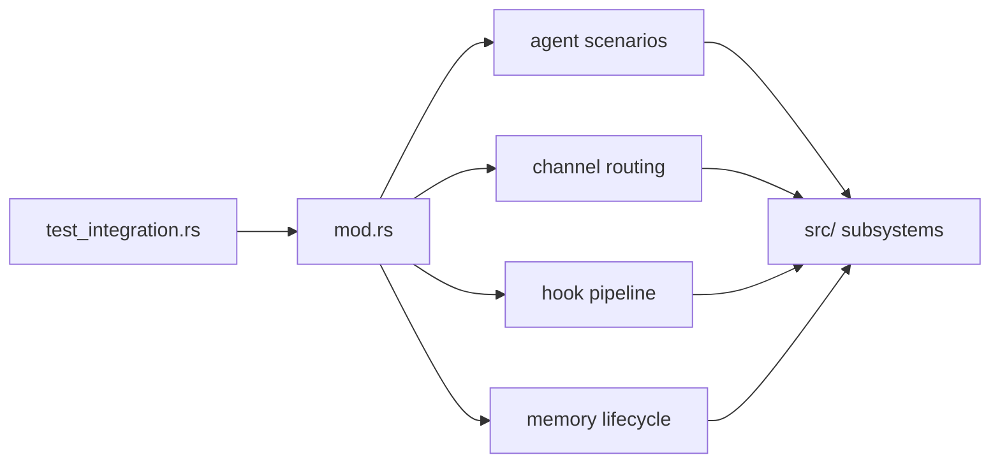

# Integration Tests Context

## Local Purpose

Cross-module Rust tests for behaviors that span agent flow, routing, hooks, and memory lifecycle concerns.

This subtree owns validation of contracts between runtime subsystems. It is the most likely test layer for proving future seam changes without paying full system-test cost.

## What Belongs Here

- cross-module behavior checks;
- tests for subsystem boundaries and wiring;
- migration-safe validation of inherited cooperation paths.

## What Does Not Belong Here

- whole-stack end-to-end coverage that belongs in `tests/system/`;
- fine-grained unit behavior better expressed in `tests/component/`;
- architecture prose that belongs in docs.

## File Map

- `mod.rs` - local suite router
- `agent.rs`, `agent_robustness.rs` - multi-part agent behavior coverage
- `channel_routing.rs` - channel dispatch behavior
- `hooks.rs` - hook pipeline interactions
- `memory_restart.rs`, `memory_comparison.rs` - persistence and memory semantics
- `telegram_attachment_fallback.rs` - integration-specific fallback scenario

## Routing

`tests/test_integration.rs` enters this subtree, then `mod.rs` exposes the focused integration scenarios above.

- boundary behavior between agent, memory, tools, routing, and hooks belongs here
- provider- or credential-dependent behavior belongs in `tests/live/`
- purely documentary migration checks belong in docs validation, not here

## Interaction Map

## Current State

This layer validates how inherited subsystems cooperate today, including behavior that would be awkward or misleading to express as a unit-style test.

## GraphClaw Relevance

As GraphClaw evolves toward a graph-native context engine, this directory is where boundary changes should prove that current runtime wiring still behaves truthfully during the transition.

## References

- `tests/CONTEXT.md` - top-level validation strategy
- `src/agent/CONTEXT.md` - agent loop boundary
- `src/memory/CONTEXT.md` - memory and retrieval boundary
- `docs/architecture/graph-context-engine.md` - target artifacts that future integration tests may need to assert explicitly

## Cautions

- Keep scenarios integration-sized, not end-to-end replicas of the whole stack.
- If a case depends on real providers or credentials, it belongs in `tests/live/`, not here.
- Do not describe current integration coverage as testing `ThinkingContext`, `GraphSet`, or `ResolutionTrace` unless those artifacts are explicit in runtime behavior and assertions.

## Agent Guidance

- Reach for this layer when component tests cannot express the real contract between modules.
- Keep setups explicit so future migration work can see which boundaries are still inherited.
