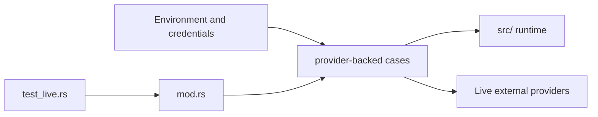

# Live Tests Context

## Scope

Environment-backed tests for real provider behavior, OAuth refresh paths, and other scenarios that need live external systems.

## File Map

- `mod.rs` - local suite router
- `providers.rs` - provider-backed validation
- `openai_codex_vision_e2e.rs` - end-to-end live provider flow
- `gemini_fallback_oauth_refresh.rs` - live OAuth refresh fallback coverage

## Routing

`tests/test_live.rs` enters this subtree. Each leaf test assumes environment setup and should state its external dependency clearly.

## Interaction Map

## Current State

These tests cover inherited provider surfaces and are intentionally slower and less deterministic than the rest of the test tree.

## GraphClaw Relevance

GraphClaw documentation can evolve quickly, but live test expectations should only move when real gateway/provider behavior changes.

## Cautions

- Never make this the default validation path when a deterministic layer can cover the risk.
- Keep provider assumptions explicit; hidden environment coupling makes failures hard to interpret.

## Agent Guidance

- Use this layer only for true external-system verification.
- If a scenario can be modeled with mocks or fixtures, keep it in `component/` or `integration/` instead.
