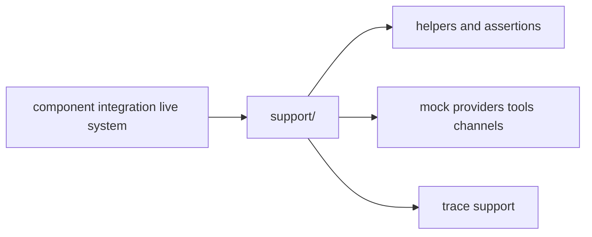

# Test Support Context

## Scope

Shared Rust-side test plumbing used across multiple suites.

## File Map

- `mod.rs` - support module router
- `helpers.rs` - common test setup utilities
- `assertions.rs` - shared assertion helpers
- `mock_provider.rs`, `mock_tools.rs`, `mock_channel.rs` - reusable doubles
- `trace.rs` - trace-oriented support code

## Routing

Other test layers import this subtree for reusable support. Nothing here should require production code to know about test-only helpers.

## Support Map

## Current State

This area centralizes inherited test scaffolding so individual suites can stay focused on behavior rather than setup boilerplate.

## GraphClaw Relevance

Shared test support is part of migration hygiene: it keeps old and new documentation or boundary work from spawning duplicated scaffolding.

## Cautions

- Keep helpers generic; suite-specific quirks belong with the suite that needs them.
- Never leak test abstractions into runtime modules just to make tests easier to write.

## Agent Guidance

- Add shared helpers here only after they are reused or clearly cross-cutting.
- Prefer readable fixtures and builders over opaque helper stacks.
