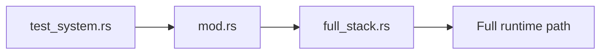

# System Tests Context

## Local Purpose

Broad end-to-end Rust tests for full-stack runtime behavior.

This subtree owns the highest-cost automated validation layer for the current runtime. It should be used to prove cross-subsystem behavior, not to compensate for missing lower-layer coverage.

## What Belongs Here

- representative end-to-end runtime scenarios;
- cross-subsystem confidence checks that cannot be localized lower;
- sparse high-value coverage for externally meaningful behavior.

## What Does Not Belong Here

- routine unit-scale behavior checks;
- architecture prose that belongs in docs;
- broad scenario sprawl that duplicates integration coverage.

## File Map

- `mod.rs` - local suite router
- `full_stack.rs` - current system-level coverage

## Routing

`tests/test_system.rs` enters this subtree. The expectation here is whole-system confidence, not fine-grained diagnosis.

- if the behavior can fail first in `component/` or `integration/`, prefer that
- if the risk is only documentary, validate docs instead of adding system tests

## Interaction Map

## Current State

System coverage is intentionally sparse and high-cost compared with component or integration tests.

## GraphClaw Relevance

As GraphClaw grows beyond the inherited baseline, this directory is where repo-wide behavior changes should eventually prove they still work together as one runtime.

## References

- `tests/CONTEXT.md` - test-layer routing and validation rules
- `docs/architecture/graph-context-engine.md` - target runtime artifacts that may later require full-stack proof

## Cautions

- Do not use system tests as the first or only layer for routine changes.
- Keep scenarios few, representative, and stable enough to justify their runtime cost.
- Do not claim system-level GraphClaw context-engine coverage before those runtime artifacts exist and are asserted explicitly.

## Agent Guidance

- Add coverage here only when the risk is truly full-stack.
- Push smaller concerns down to `component/` or `integration/` so failures stay easier to localize.
