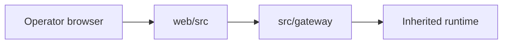

# Web Context

## Local Purpose

Frontend dashboard application, TypeScript build configuration, and browser-facing runtime glue for the inherited gateway UI.

This subtree owns the current browser-facing operator surface for the inherited runtime. It may later present explicit `SessionWindow`, `ContextPack`, or `ResolutionTrace` views, but it is not itself the Graph Context Engine.

## What Belongs Here

- frontend application structure and build configuration;
- browser-facing transport glue for the current gateway UI;
- truthful presentation of current runtime capabilities to operators.

## File Map

- `package.json` - frontend package manifest
- `vite.config.ts`, `tsconfig.json`, `tsconfig.app.json`, `tsconfig.node.json` - build and type-check setup
- `src/` - application code

## Routing

Browser entry is `src/main.tsx`, app routing lives in `src/App.tsx`, and route/page composition is delegated to `src/pages/` under a shared `components/layout/` shell.

- route and UI composition belong in `web/src/`
- HTTP, SSE, and WebSocket contracts belong in `src/gateway/`
- stable context-model questions belong in `docs/architecture/`

## Interaction Map

## Current State

This UI now tracks a more recent inherited `zeroclaw` dashboard baseline, including pairing/auth, operational pages, and the newer theme-aware dashboard shell. It is not yet a separate GraphClaw-native frontend architecture.

The GraphClaw playground no longer lives here. Graph-oriented exploration is being moved into the separate Vue application under `ui/`.

## Current Dependency Direction

- Consumes HTTP, SSE, and WebSocket behavior exposed by `src/gateway/`.
- Routes browser implementation detail into `web/src/` and its child slices.
- Can later surface `ResolutionTrace` summaries or `ContextPack`-adjacent views, but only when those runtime artifacts exist and are exposed explicitly.

## GraphClaw Relevance

The web app is part of the migration story because it exposes the runtime to operators, but it must describe current backend behavior truthfully while the context-engine direction is still emerging.

Today, this subtree contributes operator visibility over the current runtime and may later become a presentation layer for explicit GraphClaw runtime views such as `ResolutionTrace` summaries.

## References

- `web/src/CONTEXT.md` - source-tree frontend boundaries
- `src/gateway/CONTEXT.md` - API and streaming contract boundary
- `docs/architecture/graph-context-engine.md` - target model for future `SessionWindow`, `ContextPack`, and `ResolutionTrace` views the UI may later expose

## Cautions

- Do not change docs here in a way that implies backend routes or product identity have already been migrated.
- Keep frontend structure aligned with real gateway contracts and current package/tooling layout.
- Keep the inherited dashboard and the future Vue UI clearly separated: `web/` is the inherited operational dashboard, `ui/` is the GraphClaw-facing migration surface.
- Do not present a dashboard page as proof that `SessionWindow`, `ContextPack`, or `ResolutionTrace` already exist as runtime artifacts.

## Agent Guidance

- Read `web/src/CONTEXT.md` and the nearest child context before editing a frontend slice.
- Treat this subtree as a compatibility UI over the current runtime, not as proof that migration is complete.
