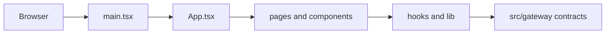

# Web Src Context

## Local Purpose

Source tree for the dashboard UI: app bootstrapping, route composition, shared layout, frontend data hooks, transport helpers, and API-facing types.

This subtree owns frontend implementation detail for the current dashboard. It can later visualize GraphClaw context concepts, but it should not invent those concepts locally.

## What Belongs Here

- browser bootstrap and route composition;
- shared UI layout and transport-aware hooks;
- frontend contract types that mirror real gateway behavior.

## What Does Not Belong Here

- speculative future GraphClaw route schemas;
- backend ownership that belongs in `src/gateway/`;
- canonical concept definitions that belong in `docs/architecture/`.

## File Map

- `main.tsx` - browser bootstrap
- `App.tsx` - auth gate, locale context, and route table
- `index.css` - shared styling entry
- `components/` - layout and reusable UI structure
- `hooks/` - auth and transport-aware React hooks
- `lib/` - API, auth, SSE, WebSocket, and i18n utilities
- `pages/` - route-level screens
- `types/` - shared frontend contract types
- `vite-env.d.ts` - Vite typing glue

## Routing

`App.tsx` currently routes `/`, `/agent`, `/tools`, `/cron`, `/integrations`, `/memory`, `/config`, `/cost`, `/logs`, and `/doctor` through `Layout`, with unauthenticated users gated by the pairing dialog.

- page and route concerns belong in `pages/`
- reusable presentation belongs in `components/`
- transport helpers belong in `lib/` and `hooks/`
- runtime contract truth still comes from `src/gateway/`

## Interaction Map

## Current State

The source tree is compact and still organized around inherited operational pages rather than a GraphClaw-specific information architecture.

## GraphClaw Relevance

This subtree is where future GraphClaw UX can evolve, but for now it should continue to mirror the baseline runtime honestly and preserve inherited naming where the code still depends on it.

## References

- `web/CONTEXT.md` - parent web boundary
- `src/gateway/CONTEXT.md` - transport contract boundary
- `docs/architecture/glossary.md` - stable vocabulary if UI labels later surface GraphClaw concepts

## Cautions

- Keep page logic, shared hooks, and transport helpers separated; avoid moving everything into `App.tsx`.
- Do not encode speculative future routes or API contracts in context docs or types.
- Do not rename current operational pages as if they already represent `ThinkingContext` or `ContextPack` views.

## Agent Guidance

- Move downward to the nearest child `CONTEXT.md` before editing a slice.
- When documenting or changing navigation, verify the real route table in `App.tsx` first.
