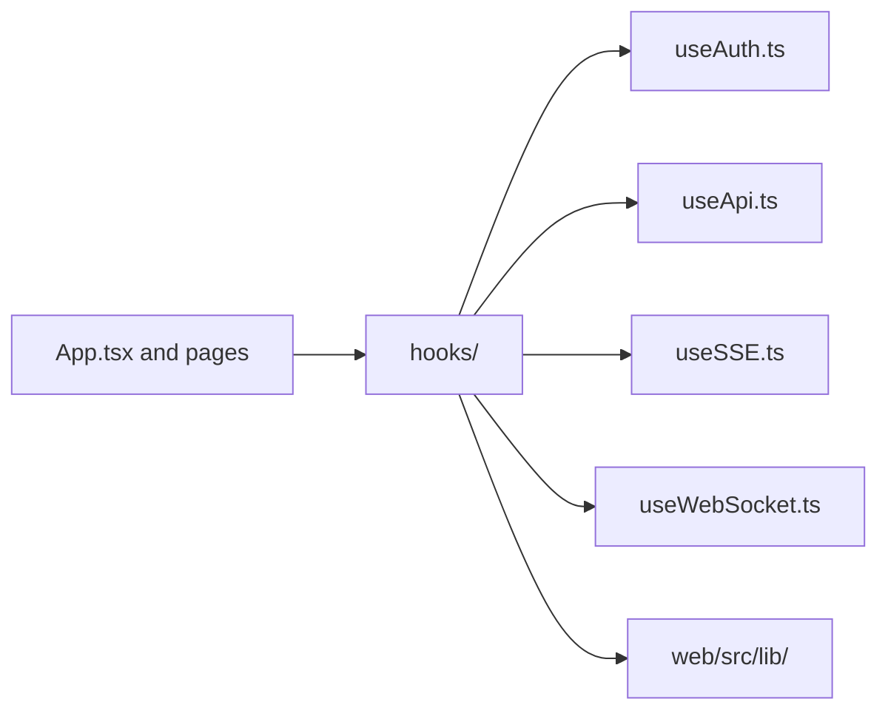

# Web Hooks Context

## Scope

React hooks for frontend session state and transport-driven behavior.

## File Map

- `useAuth.ts` - pairing/auth lifecycle
- `useApi.ts` - HTTP request hook surface
- `useSSE.ts` - server-sent event subscription flow
- `useWebSocket.ts` - WebSocket lifecycle management

## Routing

Pages and `App.tsx` consume these hooks; transport primitives underneath live in `web/src/lib/`.

## Hook Flow

## Current State

The hook layer is thin and closely tied to the current gateway interaction model.

## GraphClaw Relevance

These hooks are a likely migration seam for future GraphClaw UX work, but today they still reflect inherited runtime auth and transport contracts.

## Cautions

- Do not hide backend contract mismatches behind hook-local assumptions.
- Keep hook responsibilities narrow; if logic is transport infrastructure, move it to `web/src/lib/`.

## Agent Guidance

- Put reusable async/session behavior here instead of duplicating it across pages.
- Verify the real backend event or auth flow before updating hook documentation or behavior.
