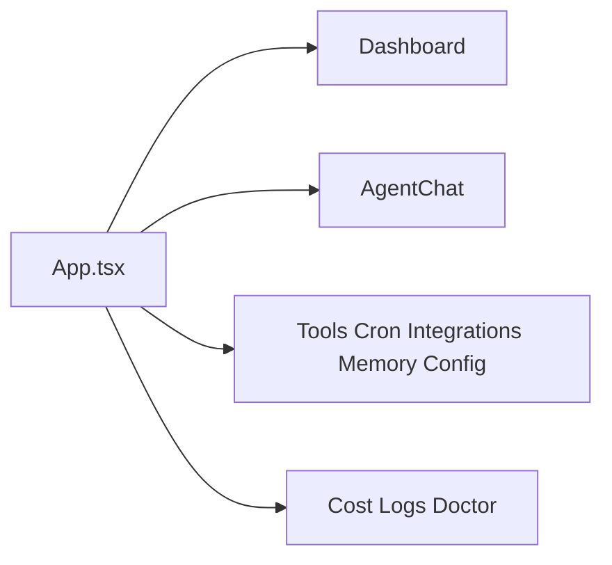

# Web Pages Context

## Local Purpose

Route-level screens for the operational dashboard.

This subtree owns page-level composition for the current operator dashboard. It may later surface GraphClaw concepts to users, but it should not invent those concepts ahead of the runtime or architecture docs.

## What Belongs Here

- route-level UI composition;
- page-specific loading, rendering, and interaction behavior;
- truthful presentation of current gateway-backed operations.

## What Does Not Belong Here

- shared view logic that belongs in `components/`, `hooks/`, or `lib/`;
- speculative route semantics not mounted in `App.tsx`;
- canonical GraphClaw concept definitions that belong in `docs/architecture/`.

## File Map

- `Dashboard.tsx` - default landing page
- `AgentChat.tsx` - agent interaction view
- `Tools.tsx`, `Cron.tsx`, `Integrations.tsx`, `Memory.tsx`, `Config.tsx` - operational control pages
- `Cost.tsx`, `Logs.tsx`, `Doctor.tsx` - diagnostics and observability views

## Routing

`web/src/App.tsx` maps `/` to `Dashboard`, `/agent` to `AgentChat`, `/tools` to `Tools`, `/cron` to `Cron`, `/integrations` to `Integrations`, `/memory` to `Memory`, `/config` to `Config`, `/cost` to `Cost`, `/logs` to `Logs`, and `/doctor` to `Doctor`.

- route-level composition belongs here
- shared transport or data helpers belong in `web/src/lib/` and `web/src/hooks/`
- contract truth still comes from `src/gateway/` and `web/src/types/`

## Route Map

## Current State

Pages are organized around inherited gateway/runtime operations instead of a new GraphClaw-specific domain model.

## Current Dependency Direction

- Consumes shared types, hooks, and transport helpers from the surrounding `web/src/` tree.
- Mirrors mounted runtime capabilities exposed by `src/gateway/`.
- Can later present explicit `ResolutionTrace` or `ContextPack` views only if those artifacts become real API surfaces.

## GraphClaw Relevance

This is where user-facing migration eventually becomes visible, so context docs should clearly separate current operational pages from future architecture aspirations.

Today, this subtree contributes route-level visibility over current runtime capabilities and is a likely future presentation surface for explicit GraphClaw concepts once they exist.

## References

- `web/src/CONTEXT.md` - parent frontend boundary
- `web/src/types/CONTEXT.md` - shared frontend contract boundary
- `src/gateway/CONTEXT.md` - backend transport boundary

## Cautions

- Keep reusable view logic in `components/` or `hooks/`, not spread across page files.
- Do not document routes that are not actually mounted in `App.tsx`.
- Do not rename operational pages as if they already represent `ThinkingContext`, `SessionWindow`, or `ContextPack` views.

## Agent Guidance

- Treat page files as route composition points.
- If a page starts sharing logic with another route, extract the shared part downward instead of widening both pages.
