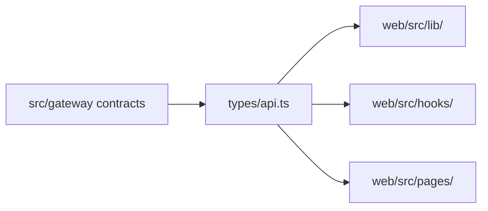

# Web Types Context

## Local Purpose

Shared TypeScript contract definitions for frontend API usage.

This subtree owns frontend-facing contract types for the current gateway surface. It is a sensitive migration seam because names and shapes can imply architectural claims even before backend behavior changes.

## What Belongs Here

- shared request and response types that mirror real runtime payloads;
- dependency-light contract types used across hooks, pages, and transport helpers.

## What Does Not Belong Here

- speculative future GraphClaw payloads;
- purely view-local aliases better kept next to a specific page or component;
- canonical concept definitions that belong in `docs/architecture/`.

## File Map

- `api.ts` - typed request/response shapes used across pages, hooks, and transport helpers

## Routing

This subtree feeds types outward into `lib/`, `hooks/`, and page components. It should stay dependency-light and contract-focused.

- if the backend contract changes, update these types here
- if a label is conceptual rather than contractual, document it in `docs/architecture/` instead of inventing an API type
- if a type is page-local, keep it local instead of promoting it here

## Contract Flow

## Current State

The type surface is small and tracks the inherited gateway API rather than a GraphClaw-native contract layer.

## GraphClaw Relevance

Typed contracts are one of the clearest migration seams, so accuracy matters more than branding here while the repo still depends on inherited backend names and shapes.

## References

- `web/src/CONTEXT.md` - parent frontend boundary
- `src/gateway/CONTEXT.md` - source of transport contract truth
- `docs/architecture/glossary.md` - stable terms that should not be confused with live API shapes

## Cautions

- Do not add speculative future API types just to prepare for migration.
- Keep types as the source of truth for shared contracts, not a dumping ground for view-only aliases.
- Do not rename payloads to `ContextPack`, `SessionWindow`, or similar GraphClaw terms unless the backend contract actually exposes those artifacts.

## Agent Guidance

- Update these types when the real backend contract changes.
- Preserve strict alignment with current runtime payloads and naming until an explicit migration task says otherwise.
